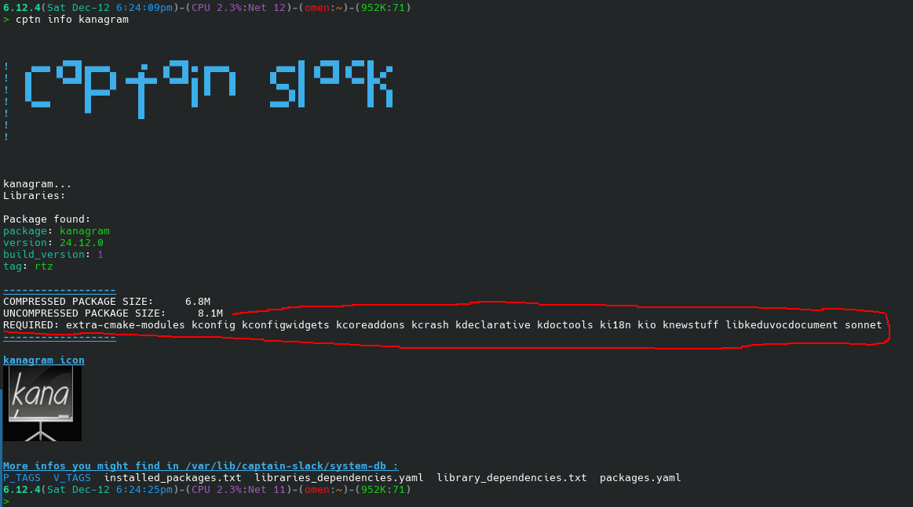

# ATHOS

> We\'re living the future so
> the present is our past.


## What is AthOS

AthOS is **not**:

* a package manager
- a package manager
+ a package manager

AthOS **is**:

1. A different way to build packages for Slackware
2. A more simple way to maintain a local repo of your build scripts


#### HELP FILES

More informations you can find in [HOWTO.md][1], [INSTALL.md][2], [required.md][3] and [special-cases.md][4]

[1]: ./DOCS/HOWTO.md        'HOWTO.md'
[2]: ./DOCS/INSTALL.md  "INSTALL.md"
[3]: ./DOCS/required.md    "required.md"
[4]: ./DOCS/special-cases.md (special-cases.md)


---

##### Commands

```
Usage:
  athos package_name        # To build and install package
  athos package_name mkbuild # To create a new package build template
  athos package_name mkedit # To edit package ini file
  athos package_name mklog # To view PackageBuild.log
  
```

To replace my name for Packager in all ini files open a terminal here in this folder and command:
```
find ./ -type f -name "*.ini" -exec sed -i 's/Packager="Anagnostakis Ioannis <rizitis@gmail.com>"/Packager="New Name <newemail@example.com>"/g' {} +

```
Edit above command as needed for your name and email... `New Name <newemail@example.com>`

To change my $TAG `_rtz` with yours: 
```
find ./ -type f -name "*.ini" -exec sed -i 's/_rtz/_newtag"/g' {} +
```
Also edit `_newtag` with your in cli^
---

In dev-stuff are some scripts that help me to maintain athos for plasma6 something that you might need is the <br>
`edit-ini-files-for-new-versions.sh`, this script read `CURRENT-VERSIONS.env` and `NEW-VERSIONS.env` and execute a sed -i command for update versions to all ini files when needed.<br>
**Example:**<br>
1. assume plasma next month new version is `6.2.5` just edit `NEW-VERSIONS.env` and make line NEW_PLASMA=6.2.`5`
2. `sudo bash edit-ini-files-for-new-versions.sh` and check everything is ok, so far no edits happens for real, you can check in terminal output or read `file_list.log` to confirm.
3. If everyhting is ok then you can execute again script `sudo bash edit-ini-files-for-new-versions.sh --edit` to edit files. Now your scripts are in focussed in new versions.

---

#### Captain-Slack
The way athos build packages also include in `/usr/doc/$PRGNAM-$VERSION/slack-required`<br>
all information about REQUIRED: for every pkg it build and install in a Slackware system.<br>
So if you have [Cpatain-Slack](https://github.com/rizitis/captain-slack) installed, it will also print this information.<br>
This was a suggestions of [conraid](https://github.com/conraid/SlackBuilds/issues/37) and he also started budling his packages<br>
copying requitments in the same file.<br>
So Captain-Slack will work with his packages also!.<br>
That said, I want to mention that reason for this is **not** a new package manager for dependency resolution.<br>
There very good package managers out there for this job already. The main goal is that dependency information for every unofficial build is very, very good to exist in the system after package installation for a lot of reasons. It would be for official packages also but our BDFL has different opinion.<br>
> *I hope more people adopt this so we can finally have a nice data base localy for every file...*

---

**EXAMPLE**<br>




