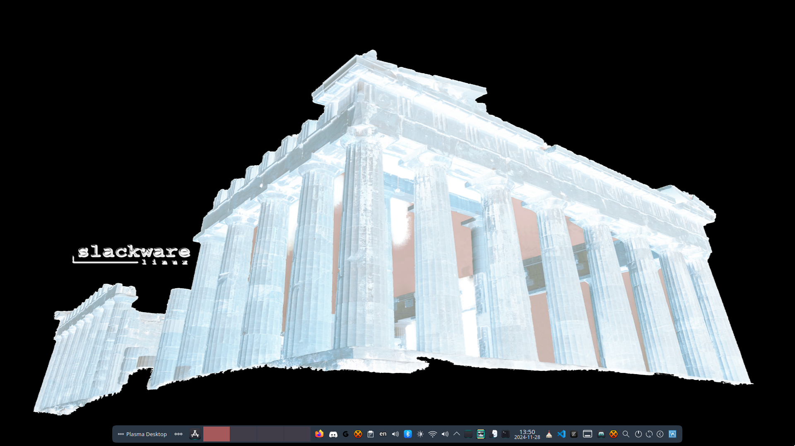
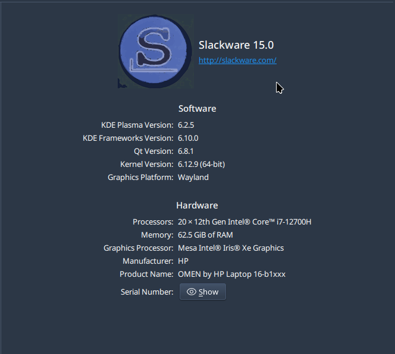
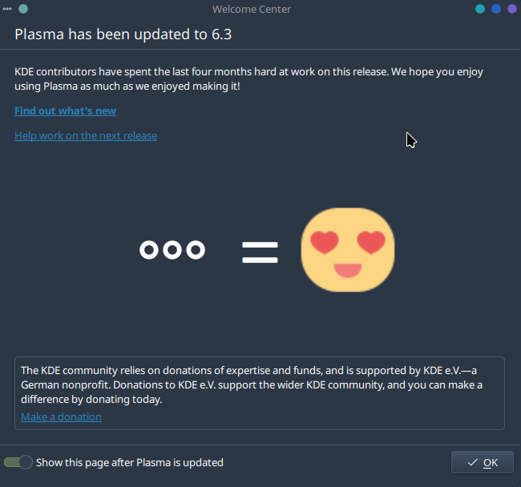

**Here is my way for a Plasma6. It is not a fork of anyone but a work from scratch.**  

## HowTO

0. Read [README-AthOS.md](https://github.com/rizitis/PLASMA_WORLD/tree/main/AthOS/README-AthOS.md) and then install all deps needed from [Ponce-Alien repos and pip](https://github.com/rizitis/PLASMA_WORLD/tree/main/AthOS/DEPS-BEFORE-BUILD).
1. `sudo bash setup.sh` to install athos.
Now you are ready to build Plasma 6 and **every other package** you will create

## Build Plasma6

1. `athos frameworks6-meta`
2. `athos plasma-workspace`
3. `athos plasma-desktop-meta` for PC or `athos plasma-mobile` for Mobile-Tablets etc..

Now you can install anything else exist in repo and you need by command: `athos package-name`  

If you want to build **EVERYTHING** then `cd dev-stuff` and always as root command: `bash FULL_UPGRADE_ALL.sh` 
You may now have your holidays and when come back Plasma6 will be there... 

---

---

`If it is not understood do not ask and do not open an issue,` *but if you have to offer code because you want to.* **Welcome to the PR** 

**Anyway The license allows you to do whatever you like...** 
Also a video of how it works is [here](https://www.youtube.com/watch?v=3y7ZFGxRub4&t=3225s)

---

plasma-mobile-desktop

YouTube:https://www.youtube.com/watch?v=vb6b-Hw7pVs just for fun...

---

PS. It is public for 2 reasons:
- To give you infos about dependencies of every plasma-pkg build and to provide a proper Slackware [build](https://develop.kde.org/docs/getting-started/building/cmake-build/) as plasma devs suggest. So not copy paste scripts from aur and ship all systemd stuff in Slack...
- because ...

---
**NOTE** that:
- since I like the way athos is building, I use it everyday. So from time to time am adding more build.ini...**not only Plasma6**. 
- if dependencies from **ponce** repo or **conraid** are ok for build a package then I use those repos, so when you missing a dep and its not here then you must install it from there.
- if you need to build a package from here because you dont find it in SBo or else, BUT you dont like how athos is building, just copy the slackbuild function from here ini file and patches if needed. Then you can make a traditional SlacBuild ;)
 All builds names listed in file [BUILDS](./BUILDS)

 

 Have fun.!

-r

