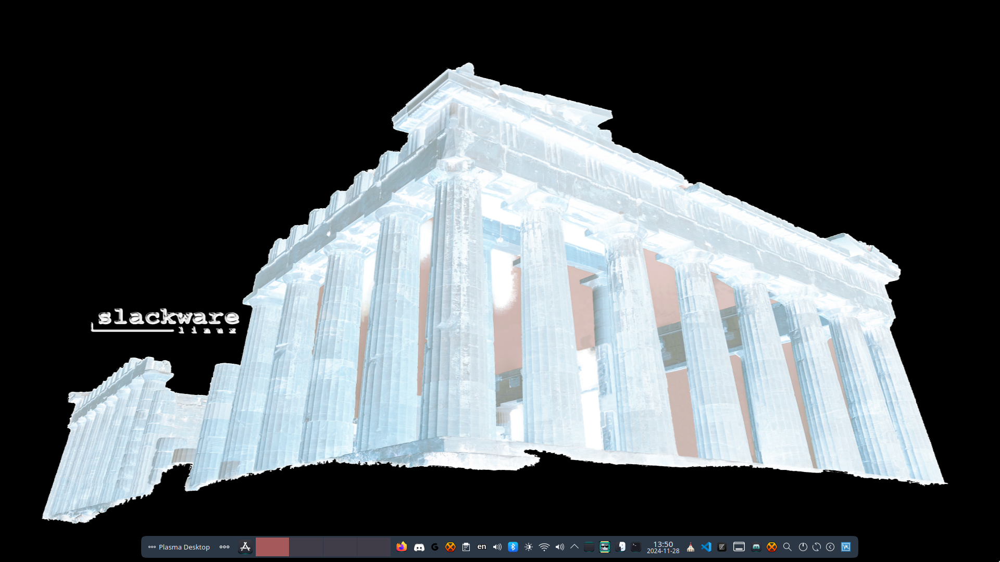

Athos is Slackware package builder. [README](https://github.com/rizitis/Athos/tree/main/AthOS#readme) 
For example you can use athos to build a full plasma 6 desktop for Slackware. 
---

**Here is my way for a Plasma6 and more... It is not a fork of anyone but a work from scratch.**  

## HowTO

The tool I use for building and install local packages in my Slackware64-current system is `athos`.

IF you want to use it: 

0. clone repo.
1. Read [README.md](https://github.com/rizitis/PLASMA_WORLD/tree/main/AthOS/README.md) and then install all deps needed from [Ponce-Alien-Conraid repos and some pip also](https://github.com/rizitis/PLASMA_WORLD/tree/main/AthOS/DEPS-BEFORE-BUILD).
2. `sudo bash setup.sh` to install athos.
3. `nano /etc/Athos/athos.env` and replace **Packager** and **TAG** with yours.

Now you are ready to build Plasma 6 and **every other package** you will find here or create as log as you **dont** remove clone folder from its place.

## TO Build Plasma6

1. `athos frameworks6-meta`
2. `athos plasma6-meta`
3. `athos kde6-meta`
4. `athos kde5-meta`
5. `athos kde-orphans-meta` 

Now you can install anything else exist in repo and you need it by command: `athos package-name`  

If you want to take updates just a `athos update` is enough.

---

`If it is not understood do not ask and do not open an issue,` *but if you have to offer code because you want to.* **Welcome to the PR** 

**Anyway The license allows you to do whatever you like...** 
Also a video of how it works is [here](https://youtu.be/3y7ZFGxRub4?si=vKJ8OYqjzEoD9Zli)

---

plasma-mobile-desktop

YouTube:https://www.youtube.com/watch?v=vb6b-Hw7pVs just for fun...

---

#### PS. It is public for 2 reasons:
- To give you infos about dependencies of every plasma-pkg build and to provide a proper Slackware [build](https://develop.kde.org/docs/getting-started/building/cmake-build/) as plasma devs suggest. So not copy paste scripts from aur **and ship all systemd stuff** in Slack...
- because ...

---
**NOTE** that:
- since I like the way athos is building, I use it everyday. So from time to time am adding more build.ini...**not only Plasma6**. 
- if dependencies from **ponce** repo or **conraid** are ok for build a package then I use those repos, so when you missing a dep and its not here then you must install it from there.
- if you need to build a package from here because you dont find it in SBo or else, BUT you dont like how athos is building, just copy the slackbuild function from here ini file and patches if needed. Then you can make a traditional SlacBuild ;)
 All builds names listed in file [BUILDS](./BUILDS)

 

 Have fun.!

-r

---

- - -
Standard Slackware-current disclaimer follows...

Standard disclaimer follows... putting this back since some folks forgot ;-)

Welcome to Slackware-current!

*** upgradepkg aaa_glibc-solibs before other      ***
*** packages. Take care not to miss new packages: ***
*** upgradepkg --install-new  is (as always) the  ***
*** safest approach.                              ***

Slackware-current is a snapshot of the active Slackware development tree.
It is intended to give developers (and other Linux gurus) a chance to test
out the latest packages for Slackware. The feedback we get will allow us
to make the next stable release better than ever.

See the ChangeLog.txt for a list of changes in Slackware-current.

Please note that the code in this directory is unstable. It might be 
inconsistent about which version of the Linux kernel is required, could be
incomplete because it's in the process of being uploaded, or might not work
for other reasons. In most cases, we know about these things and are working
to correct them, but still -- feel free to point out the bugs.

Production use is AT YOUR OWN RISK and is not recommended.

Security is NOT GUARANTEED. In -current, forward progress often takes
priority. Security fixes take time and resources, and would often have to
be done more than once. It's more efficient to build the system and secure
it as time permits and/or the development cycle nears completion.

We do not promise to issue security advisories for Slackware-current.

Slackware-current might DELETE FILES WITHOUT WARNING when packages are
upgraded. (If, for example, a directory location is replaced by a symbolic
link to a new location.) Upgrade packages carefully. Examine incoming
updates first if your machine's data is not expendable. Again, we do not
recommend using Slackware-current to store or process valuable data.
It is a system in testing, not one that is ready to go (though often it does
work just fine... BUT DON'T COUNT ON IT) 

#include BSD license warranty disclaimer here...

Enjoy! :)

Patrick J. Volkerding
`volkerdi@slackware.com`

